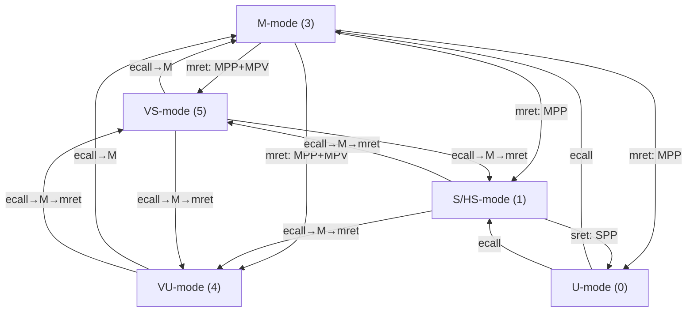

**中文 | [English](../developer_guide_en/create_test_en.md)**

# 开发者指南

## 1. 核心测试框架 API 速查

以下是最常用的核心 API。完整 API 详情请参阅各框架文档：

| 框架 | 文档 |
|------|------|
| 通用测试框架 | [`framework/test_framework.md`](../framework/test_framework.md) |
| PMP / Smepmp / SPMP | [`framework/pmp_framework.md`](../framework/pmp_framework.md) |
| 虚拟内存 (Sv39/48/57) | [`framework/vm_framework.md`](../framework/vm_framework.md) |
| Hypervisor (H) | [`framework/hypervisor_framework.md`](../framework/hypervisor_framework.md) |
| AIA（中断） | [`framework/aia_framework.md`](../framework/aia_framework.md) |
| ZPM（指针掩码） | [`framework/zpm_framework.md`](../framework/zpm_framework.md) |
| 构建系统 | [`framework/build_framework.md`](../framework/build_framework.md) |

### 测试生命周期

| 宏 | 描述 |
|----|------|
| `TEST_REGISTER(fn)` | 注册测试函数（通过 `.test_table` 链接器段自动收集） |
| `TEST_BEGIN(name)` | 开始测试：打印名称，重置状态 |
| `TEST_END()` | 结束测试：恢复 M-mode，重置状态，打印 PASS/FAIL，返回结果。**内含 `return` — 其后不可编写代码。** |
| `TEST_SKIP(reason)` | 跳过测试：打印原因，返回成功（跳过不算失败） |
| `TEST_FATAL(reason)` | 终止测试：不可达路径，打印原因，显式标记失败 |

### 断言宏（仅 M-mode）

| 宏 | 描述 |
|----|------|
| `TEST_ASSERT(msg, cond)` | 检查布尔条件 |
| `TEST_ASSERT_EQ(msg, actual, expected)` | 检查两个值是否相等 |
| `TEST_ASSERT_NEQ(msg, actual, not_expected)` | 检查两个值不相等（验证状态变化） |
| `TEST_ASSERT_BITS(msg, value, mask, expected)` | 检查 `(value & mask) == (expected & mask)` — CSR 位域验证 |

### 异常测试宏（M-mode）

| 宏 | 描述 |
|----|------|
| `EXPECT_NO_TRAP(stmt)` | 执行语句，断言未触发异常 |
| `EXPECT_TRAP(cause, stmt)` | 执行语句，断言触发了指定原因的异常 |
| `EXPECT_EXEC_NO_TRAP(addr)` | 跳转到指定地址执行，断言未触发异常 |
| `EXPECT_EXEC_TRAP(cause, addr)` | 跳转到指定地址执行，断言触发了指定原因的异常 |

**M-mode 双重陷阱变体**（Smdbltrp 支持，在触发陷阱前清除 `mstatus.MDT`）：

| 宏 | 描述 |
|----|------|
| `M_TRAP_EXPECT_BEGIN()` | 清除 MDT 后开始陷阱期望 |
| `M_EXPECT_TRAP(cause, stmt)` | 清除 MDT 后执行 `EXPECT_TRAP` |
| `M_EXPECT_NO_TRAP(stmt)` | 清除 MDT 后执行 `EXPECT_NO_TRAP` |

### 陷阱查询 API

| 函数 | 返回值 | 描述 |
|------|--------|------|
| `trap_was_triggered()` | `bool` | 是否触发了陷阱 |
| `trap_get_cause()` | `uintptr_t` | 异常原因码 (mcause) |
| `trap_get_epc()` | `uintptr_t` | 异常 PC (mepc) |
| `trap_get_tval()` | `uintptr_t` | 异常附加值 (mtval) |
| `trap_get_htval()` | `uintptr_t` | 客户物理地址 >> 2（需要 ENABLE_HYP） |
| `trap_get_htinst()` | `uintptr_t` | 变换后的指令（需要 ENABLE_HYP） |
| `trap_get_gva()` | `bool` | hstatus.GVA 位（需要 ENABLE_HYP） |

### S/U-mode 安全宏（两阶段模式）

在 S/U-mode 下，`printf`/UART 不可用。使用 **PRIV_DO + CHECK** 两阶段模式：

| 宏 | 阶段 | 描述 |
|----|------|------|
| `PRIV_DO(stmt)` | S/U-mode | 执行 load/store/CSR 操作（陷阱被保护性记录） |
| `PRIV_DO_EXEC(addr)` | S/U-mode | 测试指定地址的指令执行权限 |
| `CHECK_NO_TRAP(msg)` | M-mode | 断言未发生异常 |
| `CHECK_TRAP(msg, cause)` | M-mode | 断言发生了指定异常 |

> **兼容性**：旧名称 `PRIV_DO_NO_TRAP` / `PRIV_DO_TRAP` / `PRIV_DO_EXEC_NO_TRAP` / `PRIV_DO_EXEC_TRAP` 仍可作为别名使用，但新代码应使用 `PRIV_DO` / `PRIV_DO_EXEC`。

**使用模式：**

```c
goto_priv(PRIV_S);
PRIV_DO(mem_load32(addr));           /* 阶段1：在 S-mode 下执行 */
PRIV_DO(mem_store32(addr, 0));       /* 阶段1：在 S-mode 下执行 */
goto_priv(PRIV_M);
CHECK_NO_TRAP("read should succeed");           /* 阶段2：在 M-mode 下断言 */
CHECK_TRAP("write should fault", CAUSE_SAF);    /* 阶段2：在 M-mode 下断言 */
```

### 特权级切换

```c
/* 基本特权级 */
goto_priv(PRIV_U);   // 切换到 User mode
goto_priv(PRIV_S);   // 切换到 Supervisor mode（ENABLE_HYP=1 时为 HS-mode）
goto_priv(PRIV_M);   // 切换到 Machine mode

/* 虚拟化特权级（需要 ENABLE_HYP=1） */
goto_priv(PRIV_VS);  // 切换到 Virtual Supervisor mode (V=1, nominal S)
goto_priv(PRIV_VU);  // 切换到 Virtual User mode (V=1, nominal U)

/* 查询与函数执行 */
unsigned get_current_priv(void);
uintptr_t run_in_priv(unsigned priv, uintptr_t (*fn)(uintptr_t), uintptr_t arg);
```

**特权级切换路径概览**（包含虚拟化模式）：



### 内存操作（`mem_ops.h`，均使用 `.option norvc`）

| 函数 | 描述 |
|------|------|
| `mem_load8/16/32/64(addr)` | 加载（lb/lh/lw/ld） |
| `mem_store8/16/32/64(addr, val)` | 存储（sb/sh/sw/sd） |
| `mem_amo_swap_w(addr, val)` | 原子交换（amoswap.w） |
| `mem_lr_w(addr)` / `mem_sc_w(addr, val)` | 加载保留 / 条件存储 |
| `exec_at(addr)` | 跳转到指定地址执行（地址处须包含 `nop; ret`） |

### 日志（`LOG_LEVEL` 编译时控制）

| 宏 | 级别 | 用途 |
|----|------|------|
| `LOG_E(fmt, ...)` | 1 - Error | 错误信息 |
| `LOG_W(fmt, ...)` | 2 - Warn | 警告信息 |
| `LOG_I(fmt, ...)` | 3 - Info | 一般信息（默认可见） |
| `LOG_D(fmt, ...)` | 4 - Debug | 调试信息 |
| `LOG_T(fmt, ...)` | 5 - Trace | 跟踪信息 |

### 常用异常原因码

| 常量 | 值 | 含义 |
|------|----|------|
| `CAUSE_IAF` | 1 | 指令访问错误 |
| `CAUSE_ILI` | 2 | 非法指令 |
| `CAUSE_LAF` | 5 | 加载访问错误 |
| `CAUSE_SAF` | 7 | 存储/AMO 访问错误 |
| `CAUSE_ECU` / `CAUSE_ECS` | 8/9 | U/S-mode ecall |
| `CAUSE_IPF` | 12 | 指令页错误 |
| `CAUSE_LPF` | 13 | 加载页错误 |
| `CAUSE_SPF` | 15 | 存储/AMO 页错误 |
| `CAUSE_VIRTUAL_INSTRUCTION` | 22 | 虚拟指令异常（H 扩展） |
| `CAUSE_INST_GUEST_PAGE_FAULT` | 20 | 客户页错误 — 指令（H 扩展） |
| `CAUSE_LOAD_GUEST_PAGE_FAULT` | 21 | 客户页错误 — 加载（H 扩展） |
| `CAUSE_STORE_GUEST_PAGE_FAULT` | 23 | 客户页错误 — 存储（H 扩展） |

---

### PMP 配置 API（`common/pmp/`，ENABLE_PMP=1）

```c
typedef struct {
    uintptr_t addr;   /* pmpaddr 值（NAPOT 编码或 TOR 上界） */
    uint8_t   cfg;    /* pmpcfg 字节: L | A[1:0] | X | W | R */
} pmp_entry_t;

/* 辅助宏 */
#define PMP_CFG(L, A, X, W, R)         /* 构造 pmpcfg 字节 */
#define PMP_ENTRY_NAPOT(base, size, perm)  /* 构造 NAPOT 条目 */
#define PMP_ENTRY_TOR(upper, perm)         /* 构造 TOR 条目 */
#define PMP_RWX / PMP_RW / PMP_RX / PMP_R / PMP_X  /* 常用权限组合 */

/* API 函数 */
void pmp_set_entry(unsigned int idx, const pmp_entry_t *entry);
void pmp_get_entry(unsigned int idx, pmp_entry_t *entry);
void pmp_set_entries(unsigned int start_idx, const pmp_entry_t *entries, unsigned int count);
void pmp_clear_all(void);
unsigned int pmp_get_num_entries(void);
```

**PMP 测试内存区域**（链接器定义，各 64KB）：

| 符号 | 用途 |
|------|------|
| `__pmp_test_data` | 数据区域 — R/W 权限测试 |
| `__pmp_test_code` | 代码区域 — X 权限测试（启动时填充 `nop;ret`） |
| `__pmp_test_nomap` | 未映射区域 — 无 PMP 规则匹配测试 |

**测试辅助函数：**

```c
void pmp_setup_fw_exec(void);        /* 条目15：大 NAPOT RWX 覆盖固件 */
void pmp_clear_unlocked(void);       /* 清除所有 L=0 条目，跳过 L=1 */
void pmp_deny_region(unsigned int idx, uintptr_t base, uintptr_t size);
void pmp_test_read(uintptr_t addr, int priv, bool expect_ok, const char *msg);
void pmp_test_write(uintptr_t addr, int priv, bool expect_ok, const char *msg);
void pmp_test_exec(uintptr_t addr, int priv, bool expect_ok, const char *msg);
```

**mseccfg 寄存器（Smepmp）：**

```c
uint64_t mseccfg_read(void);
void mseccfg_write(uint64_t val);
void mseccfg_set(uint64_t bits);
void mseccfg_clear(uint64_t bits);       /* MML/MMWP 为粘性位 — 清除操作被忽略 */
bool smepmp_is_supported(void);
/* 常量: MSECCFG_MML (bit 0), MSECCFG_MMWP (bit 1), MSECCFG_RLB (bit 2) */
```

---

### 虚拟内存 API（`common/vm/`，ENABLE_VM=1）

支持 Sv39（3 级）、Sv48（4 级）、Sv57（5 级）页表及恒等映射。

```c
typedef struct {
    int mode;           /* SATP_MODE_SV39/SV48/SV57 */
    uintptr_t root_ppn; /* 根页表物理页号 */
    int levels;         /* 页表级数 */
    uintptr_t map_base; /* 恒等映射基地址 */
    uintptr_t map_size; /* 恒等映射大小 */
    int map_level;      /* 恒等映射使用的页级 */
} pt_context_t;
```

**页表管理：**

| 函数 | 描述 |
|------|------|
| `pt_init(ctx, mode)` | 初始化上下文，分配根页表 |
| `pt_map_page(ctx, va, pa, flags, level)` | 映射单页（4KB/2MB/1GB） |
| `pt_setup_identity_mapping(ctx, base, size, flags, level)` | 创建 VA=PA 映射（+ 自动映射 UART） |
| `pt_pool_reset()` | 重置页表池分配器 |
| `pt_destroy(ctx)` | 释放上下文资源 |
| `pt_get_pte(ctx, va, level)` | 获取 PTE 指针用于手动修改 |
| `pt_dump(ctx)` | 打印有效 PTE 条目（调试） |

**satp 控制：**

| 函数 | 描述 |
|------|------|
| `vm_enable(ctx, asid)` | 启用虚拟内存（写 satp + sfence.vma） |
| `vm_disable()` | 禁用虚拟内存（satp=Bare + 刷新 TLB） |
| `vm_sfence_vma(vaddr, asid)` | 刷新 TLB |
| `vm_switch_mode(ctx, new_mode)` | 切换 Sv 模式，重建恒等映射 |

**测试执行：**

| 函数 | 描述 |
|------|------|
| `vm_run_in_smode(ctx, fn, arg)` | 在 S-mode + VM 启用下执行 fn |
| `vm_run_in_umode(ctx, fn, arg)` | 在 U-mode + VM 启用下执行 fn（用于 Ssnpm） |

**PTE 标志位：** `PTE_V`(有效) `PTE_R`(读) `PTE_W`(写) `PTE_X`(执行) `PTE_U`(用户) `PTE_G`(全局) `PTE_A`(已访问) `PTE_D`(已脏)

> **提示**：始终设置 `PTE_A | PTE_D` 以避免硬件触发页错误来设置这些位。

---

### Hypervisor API（`common/hyp/`，ENABLE_HYP=1）

扩展框架以支持 V=1 虚拟化：VS/VU-mode、两阶段翻译、HLV/HSV 指令。

**特权级切换：**

```c
void goto_vs_mode(void);      /* HS → VS (hstatus.SPV=1, sret) */
void goto_vu_mode(void);      /* VS → VU (vsstatus.SPP=0, sret) */
void return_to_hs_mode(void); /* VS/VU → HS (ecall) */
unsigned get_virt_priv(void);  /* 返回 PRIV_M/PRIV_HS/PRIV_VS/PRIV_VU */
uintptr_t run_in_vs_mode(uintptr_t (*fn)(uintptr_t), uintptr_t arg);
uintptr_t run_in_vu_mode(uintptr_t (*fn)(uintptr_t), uintptr_t arg);
```

**G-stage 页表管理：**

```c
typedef struct {
    int mode;            /* HGATP_MODE_SV39X4/SV48X4/SV57X4 */
    uintptr_t *root_pt;  /* 16KB 对齐的根页表 */
    int levels;
} gpt_context_t;

void gpt_init(gpt_context_t *ctx, int mode);
int  gpt_map_page(gpt_context_t *ctx, uintptr_t gpa, uintptr_t spa,
                  uintptr_t flags, int level);
int  gpt_setup_identity_mapping(gpt_context_t *ctx, uintptr_t base,
                                uintptr_t size, uintptr_t flags, int level);
void gpt_pool_reset(void);
void gpt_enable(gpt_context_t *ctx, unsigned vmid);   /* 写 hgatp + hfence.gvma */
void gpt_disable(void);                                 /* hgatp.MODE=Bare */
```

**两阶段翻译：**

```c
typedef struct {
    pt_context_t  vs_ctx;   /* VS-stage (vsatp) */
    gpt_context_t g_ctx;    /* G-stage (hgatp) */
} two_stage_ctx_t;

void two_stage_init(two_stage_ctx_t *ctx, int vs_mode, int g_mode);
int  two_stage_setup_identity(two_stage_ctx_t *ctx, uintptr_t base,
                               uintptr_t size, uintptr_t flags, int level);
uintptr_t two_stage_run_in_vs(two_stage_ctx_t *ctx,
                               uintptr_t (*fn)(uintptr_t), uintptr_t arg);
void two_stage_cleanup(two_stage_ctx_t *ctx);
```

**HFENCE 与 HLV/HSV：**

```c
/* TLB 刷新 */
void hfence_vvma(uintptr_t vaddr, uintptr_t asid);   /* VS-stage TLB */
void hfence_vvma_all(void);
void hfence_gvma(uintptr_t gpa_shifted, uintptr_t vmid); /* G-stage TLB */
void hfence_gvma_all(void);

/* 虚拟机加载/存储（HS-mode，或 HU=1 时的 U-mode） */
uint32_t hlv_w(uintptr_t addr);     /* 从客户内存读取 */
uint64_t hlv_d(uintptr_t addr);     /* 读取双字（RV64） */
uint32_t hlvx_wu(uintptr_t addr);   /* 以执行权限读取 */
void hsv_w(uintptr_t addr, uint32_t val);  /* 写入客户内存 */
void hsv_d(uintptr_t addr, uint64_t val);  /* 写入双字（RV64） */
/* 还有: hlv_b/bu/h/hu, hsv_b/h/d */
```

**Hypervisor 测试宏：**

| 宏 | 描述 |
|----|------|
| `EXPECT_VIRTUAL_INST(stmt)` | 期望虚拟指令异常 (cause=22) |
| `EXPECT_GUEST_PAGE_FAULT(cause, stmt)` | 期望客户页错误 (cause=20/21/23) |
| `HYP_TEST_END()` | 使用 `hyp_reset_state()` 的 TEST_END 变体 |
| `CHECK_HTVAL(msg, expected_gpa_shifted)` | 检查 htval 值 |
| `CHECK_HTINST(msg, expected)` | 检查 htinst 值 |
| `CHECK_GVA(msg, expected)` | 检查 hstatus.GVA |
| `REQUIRE_EXT(field)` | 子扩展未实现时跳过 |

**委托辅助函数：**

```c
void delegate_causes_to_hs(uintptr_t cause_mask);  /* medeleg */
void delegate_causes_to_vs(uintptr_t cause_mask);  /* medeleg + hedeleg */
void delegate_ints_to_vs(uintptr_t int_mask);       /* mideleg + hideleg */
```

---

### AIA API（各子模块独立，内联汇编实现）

AIA 测试子模块（`aia_aplic/`、`aia_imsic/` 等）各自包含共享头文件：`aia_encoding.h`、`aia_helpers.h`、`aia_platform.h`。

**CSR 操作：**

```c
uint64_t csr_read(unsigned int csr_num);
void csr_write(unsigned int csr_num, uint64_t val);
void csr_set(unsigned int csr_num, uint64_t mask);
void csr_clear(unsigned int csr_num, uint64_t mask);
```

**IMSIC 辅助函数：**

```c
uintptr_t platform_imsic_m_base(void);
uintptr_t platform_imsic_s_base(void);
unsigned int platform_hart_count(void);
void imsic_set_eip(unsigned int identity, int val);
void imsic_set_eie(unsigned int identity, int val);
```

**APLIC 辅助函数：**

```c
volatile void *aplic_domain_base(unsigned int domain_id);
void aplic_set_domaincfg(unsigned int domain_id, uint32_t flags);
void aplic_set_sourcecfg(unsigned int domain_id, unsigned int source, uint32_t mode);
void aplic_set_pending(unsigned int domain_id, unsigned int source);
void aplic_set_target(unsigned int domain_id, unsigned int source,
                      unsigned int hart_index, unsigned int guest_index, unsigned int eiid);
```

**I/O 与轮询：**

```c
uint32_t readl(volatile void *addr);
void writel(uint32_t val, volatile void *addr);
#define poll_with_timeout(timeout_us, condition)  /* 轮询直到条件为真或超时 */
```

---

### ZPM / 指针掩码 API（`common/pm/`，ENABLE_PM=1）

**PM 控制：**

| 函数 | 描述 |
|------|------|
| `pm_set_umode(pmm)` / `pm_get_umode()` | 控制 U-mode PM（senvcfg.PMM） |
| `pm_set_smode(pmm)` / `pm_get_smode()` | 控制 S-mode PM（menvcfg.PMM） |
| `pm_set_mmode(pmm)` / `pm_get_mmode()` | 控制 M-mode PM（mseccfg.PMM） |
| `detect_ssnpm()` / `detect_smnpm()` / `detect_smmpm()` | 检测扩展是否实现 |
| `pmm_to_pmlen(pmm)` | 将 PMM 编码转换为 PMLEN 值 |

PMM 值：`PMM_DISABLED`(0)、`PMM_RESERVED`(1)、`PMM_PMLEN7`(2)、`PMM_PMLEN16`(3)

**标记地址工具**（仅头文件 `pm_addr.h`）：

| 函数 | 描述 |
|------|------|
| `pm_tag_address(addr, tag, pmlen)` | 将标记嵌入地址 |
| `pm_extract_tag(addr, pmlen)` | 从地址提取标记 |
| `pm_transform_va(addr, pmlen)` | VA 忽略变换（符号扩展） |
| `pm_transform_pa(addr, pmlen)` | PA 忽略变换（零扩展） |
| `pm_addrs_equivalent_va(a, b, pmlen)` | 检查 VA 地址在 PM 下是否等价 |
| `pm_addrs_equivalent_pa(a, b, pmlen)` | 检查 PA 地址在 PM 下是否等价 |

---

## 2. 编写测试用例

添加新测试用例只需三个步骤。详细框架 API 文档请参阅 [`../framework/`](../framework/) 中对应文档。

### 步骤 1：创建测试文件

在 `<extension>/tests/` 中创建 `.c` 文件，使用 `TEST_REGISTER` 宏注册测试函数：

```c
#include "test_helpers.h"   /* 包含 test_framework.h + pmp_cfg.h + 辅助函数 */

extern uintptr_t __pmp_test_data;

TEST_REGISTER(test_my_feature);
bool test_my_feature(void) {
    TEST_BEGIN("My feature description");

    uintptr_t data = (uintptr_t)&__pmp_test_data;

    /* 在 M-mode 下配置硬件状态 */
    pmp_entry_t e = PMP_ENTRY_NAPOT(data, 0x1000, PMP_R);
    pmp_set_entry(0, &e);
    pmp_setup_fw_exec();   /* 条目15：允许 S-mode 执行固件 */

    /* 切换到 S-mode 进行测试 */
    goto_priv(PRIV_S);
    PRIV_DO_NO_TRAP(mem_load32(data));
    PRIV_DO_TRAP(mem_store32(data, 0));
    goto_priv(PRIV_M);

    /* 回到 M-mode 检查结果 */
    CHECK_NO_TRAP("read should succeed");
    CHECK_TRAP("write should fault", CAUSE_SAF);

    TEST_END();
}
```

### 步骤 2：注册测试

在 `<extension>/tests/test_register.c` 中 `#include` 测试文件：

```c
#include "test_my_feature.c"
```

### 步骤 3：构建并运行

```bash
make pmp CROSS_COMPILER=/path/to/riscv64-unknown-elf-
make sail-pmp   # 或 make spike-pmp
```

> **提示**：S/U-mode 下 `printf` 不可用。使用 `PRIV_DO_*` 宏执行操作，回到 M-mode 后用 `CHECK_*` 宏验证结果。

### 重要测试注意事项

1. **S/U-mode 需要 PMP 覆盖** — 如果没有匹配的 PMP 条目，S-mode 和 U-mode 的**所有访问都会被拒绝**。切换到 S/U-mode 前务必配置至少一个覆盖固件代码区域的 PMP 条目。

2. **PMP 条目优先级** — 条目从低到高匹配，首次匹配即生效。限制性测试条目使用低索引（如 0、1），允许代码执行的宽松条目使用高索引（如 15）。

3. **NAPOT 对齐** — `base` 必须自然对齐到 `size`，`size` 必须是 2 的幂（G=0 时最小 8 字节）。

4. **Smepmp 粘性位** — `mseccfg.MML` 和 `mseccfg.MMWP` 一旦置位，软件无法清除。设置这些位的测试应放在最后运行，或依赖模拟器每次调用时的全新硬件状态。

5. **S/U-mode 下不可调用框架 API** — PMP 配置 API 使用仅在 M-mode 可用的 CSR 指令。先在 M-mode 配置硬件状态，再切换特权级。S/U-mode 测试使用 `PRIV_DO_*` + `CHECK_*` 宏模式。

6. **`TEST_END()` 包含 `return`** — 不要在 `TEST_END()` 后编写代码。它会自动恢复 M-mode、重置状态并返回测试结果。

---

## 3. 添加新扩展

添加新的特权扩展（如 `iopmp/`）：

### 3.1 创建目录结构

```
iopmp/
├── Makefile
├── kernel.ld
├── main.c
└── tests/
    └── test_register.c
```

### 3.2 创建 `Makefile`（包含公共构建规则）

```makefile
TARGET   = iopmp_test.elf

# 按需链接公共库（可选）
# ENABLE_PMP = 1    # 链接 common/pmp/ 库
# ENABLE_VM  = 1    # 链接 common/vm/ 库

# 扩展特定的 Spike ISA 后缀（可选）
# SPIKE_ISA_EXT = _svnapot

EXT_OBJS = main.o tests/test_register.o

include ../common/Makefile.common
```

### 3.3 创建 `kernel.ld`（包含公共链接器段）

```ld
OUTPUT_ARCH( "riscv" )
ENTRY( _entry )

SECTIONS
{
    . = MEM_BASE;
    _start = .;

    /* 公共段 */
    .text : { *(.text.entry) *(.text .text.*) . = ALIGN(0x1000); PROVIDE(_etext = .); }
    .rodata : { . = ALIGN(16); *(.srodata .srodata.*) . = ALIGN(16); *(.rodata .rodata.*) }
    .test_table : { . = ALIGN(8); _test_table = .; *(.test_table) _test_table_end = .; }
    _test_table_size = (_test_table_end - _test_table) / (__riscv_xlen / 8);
    .data : { . = ALIGN(16); *(.sdata .sdata.*) . = ALIGN(16); *(.data .data.*) }
    .bss (NOLOAD) : {
        . = ALIGN(16); _bss_start = .;
        *(.sbss .sbss.*) . = ALIGN(16); *(.bss .bss.*)
        . = ALIGN(8); _bss_end = .;
    }
    .stack (NOLOAD) : { . = ALIGN(16); PROVIDE(__stack_start = .); . += 128 * 1024; . = ALIGN(16); PROVIDE(__stack_end = .); }

    /* 扩展特定区域放在这里 */

    PROVIDE(_end = .);
}
```

### 3.4 在顶层 `Makefile` 中注册

```makefile
EXTENSIONS = pmp smepmp spmp ... iopmp
```

### 3.5 编写测试方案文档

在 `DOCS/testplan/` 下创建 `iopmp_test_plan.md`

---

## 4. 添加新平台

### 4.1 创建配置目录

创建 `common/config/my_board/` 目录，包含以下文件：

```
common/config/my_board/
├──platfrom_config.h         # 平台硬件定义
├── rvmodel_macros.h   # 平台模型参数
└── platform.mk        # 平台构建配置
```

### 4.2 创建 platfrom_config.h`

```c
#define PLATFORM_UART0_BASE  0x10000000UL
#define PLATFORM_MEM_BASE    0x80000000UL
#define PLATFORM_MEM_SIZE    0x10000000UL
#define CONFIG_NAME          "My Board"
```

### 4.3 创建 `platform.mk`

```makefile
CROSS_COMPILER ?= riscv64-unknown-elf-
MEM_BASE       ?= 0x80000000
```

### 4.4 构建

```bash
make CONFIG=my_board XLEN=64 CROSS_COMPILER=riscv64-unknown-elf-
```

### 平台配置详情

每个平台配置包含三个关键文件：

- *platfrom_config.h**：硬件特定定义（UART 基地址、内存布局、平台特定功能）
- **platform.mk**：构建配置（交叉编译器路径、内存基址、模拟器选项）
- **rvmodel_macros.h**：平台模型参数

这些文件通过 GCC 的 `-include` 标志自动包含，因此无需在源代码中添加 `#include platfrom_config.h"`。构建系统会透明地处理这一切。

#### 平台间的关键差异

- **内存基地址**：QEMU 使用 `0x80000000`，HAPS 平台使用 `0x60000000`
- **UART 配置**：不同的基地址和寄存器布局
- **平台特定功能**：部分平台可能跳过某些测试或需要特殊初始化
- **工具链**：不同平台可能需要不同的交叉编译器
