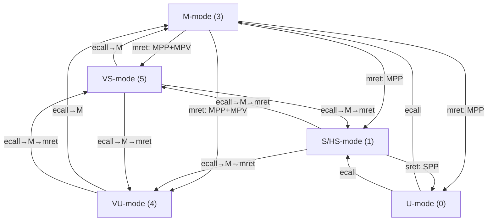

**[中文](../developer_guide/create_test.md) | English**

# Developer Guide

## 1. Core Test Framework API Quick Reference

Below are the most commonly used core APIs. For complete API details, see the framework docs:

| Framework | Documentation |
|-----------|---------------|
| Common Test Framework | [`framework_en/test_framework_en.md`](../framework_en/test_framework_en.md) |
| PMP / Smepmp / SPMP | [`framework_en/pmp_framework_en.md`](../framework_en/pmp_framework_en.md) |
| Virtual Memory (Sv39/48/57) | [`framework_en/vm_framework_en.md`](../framework_en/vm_framework_en.md) |
| Hypervisor (H) | [`framework_en/hypervisor_framework_en.md`](../framework_en/hypervisor_framework_en.md) |
| AIA (Interrupts) | [`framework_en/aia_framework_en.md`](../framework_en/aia_framework_en.md) |
| ZPM (Pointer Masking) | [`framework_en/zpm_framework_en.md`](../framework_en/zpm_framework_en.md) |
| Build System | [`framework_en/build_framework_en.md`](../framework_en/build_framework_en.md) |

### Test Lifecycle

| Macro | Description |
|-------|-------------|
| `TEST_REGISTER(fn)` | Register a test function (auto-collected via `.test_table` linker section) |
| `TEST_BEGIN(name)` | Start a test: print name, reset state |
| `TEST_END()` | End a test: restore M-mode, reset state, print PASS/FAIL, return result. **Contains `return` — do not write code after it.** |
| `TEST_SKIP(reason)` | Skip a test: print reason, return success (skip is not failure) |
| `TEST_FATAL(reason)` | Terminate test: unreachable path, print reason, explicit failure |

### Assertion Macros (M-mode only)

| Macro | Description |
|-------|-------------|
| `TEST_ASSERT(msg, cond)` | Check a boolean condition |
| `TEST_ASSERT_EQ(msg, actual, expected)` | Check two values for equality |
| `TEST_ASSERT_NEQ(msg, actual, not_expected)` | Check two values are not equal (verify state change) |
| `TEST_ASSERT_BITS(msg, value, mask, expected)` | Check `(value & mask) == (expected & mask)` — CSR bitfield verification |

### Exception Testing Macros (M-mode)

| Macro | Description |
|-------|-------------|
| `EXPECT_NO_TRAP(stmt)` | Execute statement, assert no exception triggered |
| `EXPECT_TRAP(cause, stmt)` | Execute statement, assert exception with specified cause triggered |
| `EXPECT_EXEC_NO_TRAP(addr)` | Jump to address and execute, assert no exception |
| `EXPECT_EXEC_TRAP(cause, addr)` | Jump to address and execute, assert exception with specified cause |

**M-mode Double-Trap Variants** (Smdbltrp support, clear `mstatus.MDT` before trap):

| Macro | Description |
|-------|-------------|
| `M_TRAP_EXPECT_BEGIN()` | Clear MDT then begin trap expectation |
| `M_EXPECT_TRAP(cause, stmt)` | Clear MDT then `EXPECT_TRAP` |
| `M_EXPECT_NO_TRAP(stmt)` | Clear MDT then `EXPECT_NO_TRAP` |

### Trap Query API

| Function | Return | Description |
|----------|--------|-------------|
| `trap_was_triggered()` | `bool` | Whether a trap was triggered |
| `trap_get_cause()` | `uintptr_t` | Exception cause code (mcause) |
| `trap_get_epc()` | `uintptr_t` | Exception PC (mepc) |
| `trap_get_tval()` | `uintptr_t` | Exception additional value (mtval) |
| `trap_get_htval()` | `uintptr_t` | Guest physical address >> 2 (requires ENABLE_HYP) |
| `trap_get_htinst()` | `uintptr_t` | Transformed instruction (requires ENABLE_HYP) |
| `trap_get_gva()` | `bool` | hstatus.GVA bit (requires ENABLE_HYP) |

### S/U-mode Safe Macros (Two-Phase Pattern)

In S/U-mode, `printf`/UART is unavailable. Use the **PRIV_DO + CHECK** two-phase pattern:

| Macro | Phase | Description |
|-------|-------|-------------|
| `PRIV_DO(stmt)` | S/U-mode | Execute load/store/CSR operation (trap is protectively recorded) |
| `PRIV_DO_EXEC(addr)` | S/U-mode | Test instruction execution permission at address |
| `CHECK_NO_TRAP(msg)` | M-mode | Assert no exception occurred |
| `CHECK_TRAP(msg, cause)` | M-mode | Assert specified exception occurred |

> **Compatibility**: Legacy names `PRIV_DO_NO_TRAP` / `PRIV_DO_TRAP` / `PRIV_DO_EXEC_NO_TRAP` / `PRIV_DO_EXEC_TRAP` remain usable as aliases, but new code should use `PRIV_DO` / `PRIV_DO_EXEC`.

**Usage pattern:**

```c
goto_priv(PRIV_S);
PRIV_DO(mem_load32(addr));           /* Phase 1: Execute in S-mode */
PRIV_DO(mem_store32(addr, 0));       /* Phase 1: Execute in S-mode */
goto_priv(PRIV_M);
CHECK_NO_TRAP("read should succeed");           /* Phase 2: Assert in M-mode */
CHECK_TRAP("write should fault", CAUSE_SAF);    /* Phase 2: Assert in M-mode */
```

### Privilege Switching

```c
/* Basic privilege levels */
goto_priv(PRIV_U);   // Switch to User mode
goto_priv(PRIV_S);   // Switch to Supervisor mode (HS-mode when ENABLE_HYP=1)
goto_priv(PRIV_M);   // Switch to Machine mode

/* Virtualized privilege levels (requires ENABLE_HYP=1) */
goto_priv(PRIV_VS);  // Switch to Virtual Supervisor mode (V=1, nominal S)
goto_priv(PRIV_VU);  // Switch to Virtual User mode (V=1, nominal U)

/* Query and function execution */
unsigned get_current_priv(void);
uintptr_t run_in_priv(unsigned priv, uintptr_t (*fn)(uintptr_t), uintptr_t arg);
```

**Privilege Switching Path Overview** (including virtualized modes):



### Memory Operations (`mem_ops.h`, all `.option norvc`)

| Function | Description |
|----------|-------------|
| `mem_load8/16/32/64(addr)` | Load (lb/lh/lw/ld) |
| `mem_store8/16/32/64(addr, val)` | Store (sb/sh/sw/sd) |
| `mem_amo_swap_w(addr, val)` | Atomic swap (amoswap.w) |
| `mem_lr_w(addr)` / `mem_sc_w(addr, val)` | Load-Reserved / Store-Conditional |
| `exec_at(addr)` | Jump to address to execute (addr must contain `nop; ret`) |

### Logging (`LOG_LEVEL` compile-time control)

| Macro | Level | Purpose |
|-------|-------|---------|
| `LOG_E(fmt, ...)` | 1 - Error | Error messages |
| `LOG_W(fmt, ...)` | 2 - Warn | Warning messages |
| `LOG_I(fmt, ...)` | 3 - Info | General information (default) |
| `LOG_D(fmt, ...)` | 4 - Debug | Debug information |
| `LOG_T(fmt, ...)` | 5 - Trace | Trace information |

### Common Exception Cause Codes

| Constant | Value | Meaning |
|----------|-------|---------|
| `CAUSE_IAF` | 1 | Instruction Access Fault |
| `CAUSE_ILI` | 2 | Illegal Instruction |
| `CAUSE_LAF` | 5 | Load Access Fault |
| `CAUSE_SAF` | 7 | Store/AMO Access Fault |
| `CAUSE_ECU` / `CAUSE_ECS` | 8/9 | Ecall from U/S-mode |
| `CAUSE_IPF` | 12 | Instruction Page Fault |
| `CAUSE_LPF` | 13 | Load Page Fault |
| `CAUSE_SPF` | 15 | Store/AMO Page Fault |
| `CAUSE_VIRTUAL_INSTRUCTION` | 22 | Virtual Instruction (H ext) |
| `CAUSE_INST_GUEST_PAGE_FAULT` | 20 | Guest Page Fault — Inst (H ext) |
| `CAUSE_LOAD_GUEST_PAGE_FAULT` | 21 | Guest Page Fault — Load (H ext) |
| `CAUSE_STORE_GUEST_PAGE_FAULT` | 23 | Guest Page Fault — Store (H ext) |

---

### PMP Configuration API (`common/pmp/`, ENABLE_PMP=1)

```c
typedef struct {
    uintptr_t addr;   /* pmpaddr value (NAPOT encoded or TOR upper bound) */
    uint8_t   cfg;    /* pmpcfg byte: L | A[1:0] | X | W | R */
} pmp_entry_t;

/* Helper macros */
#define PMP_CFG(L, A, X, W, R)         /* Construct pmpcfg byte */
#define PMP_ENTRY_NAPOT(base, size, perm)  /* Construct NAPOT entry */
#define PMP_ENTRY_TOR(upper, perm)         /* Construct TOR entry */
#define PMP_RWX / PMP_RW / PMP_RX / PMP_R / PMP_X  /* Common permissions */

/* API functions */
void pmp_set_entry(unsigned int idx, const pmp_entry_t *entry);
void pmp_get_entry(unsigned int idx, pmp_entry_t *entry);
void pmp_set_entries(unsigned int start_idx, const pmp_entry_t *entries, unsigned int count);
void pmp_clear_all(void);
unsigned int pmp_get_num_entries(void);
```

**PMP Test Memory Regions** (linker-defined, 64KB each):

| Symbol | Purpose |
|--------|---------|
| `__pmp_test_data` | Data region — R/W permission testing |
| `__pmp_test_code` | Code region — X permission testing (filled with `nop;ret` at boot) |
| `__pmp_test_nomap` | Unmapped region — No PMP rule match testing |

**Test Helper Functions:**

```c
void pmp_setup_fw_exec(void);        /* Entry 15: large NAPOT RWX for firmware */
void pmp_clear_unlocked(void);       /* Clear all L=0 entries, skip L=1 */
void pmp_deny_region(unsigned int idx, uintptr_t base, uintptr_t size);
void pmp_test_read(uintptr_t addr, int priv, bool expect_ok, const char *msg);
void pmp_test_write(uintptr_t addr, int priv, bool expect_ok, const char *msg);
void pmp_test_exec(uintptr_t addr, int priv, bool expect_ok, const char *msg);
```

**mseccfg Register (Smepmp):**

```c
uint64_t mseccfg_read(void);
void mseccfg_write(uint64_t val);
void mseccfg_set(uint64_t bits);
void mseccfg_clear(uint64_t bits);       /* MML/MMWP are sticky — clear ignored */
bool smepmp_is_supported(void);
/* Constants: MSECCFG_MML (bit 0), MSECCFG_MMWP (bit 1), MSECCFG_RLB (bit 2) */
```

---

### Virtual Memory API (`common/vm/`, ENABLE_VM=1)

Supports Sv39 (3-level), Sv48 (4-level), Sv57 (5-level) page tables with identity mapping.

```c
typedef struct {
    int mode;           /* SATP_MODE_SV39/SV48/SV57 */
    uintptr_t root_ppn; /* Root page table physical page number */
    int levels;         /* Number of page table levels */
    uintptr_t map_base; /* Identity mapping base address */
    uintptr_t map_size; /* Identity mapping size */
    int map_level;      /* Page level used for identity mapping */
} pt_context_t;
```

**Page Table Management:**

| Function | Description |
|----------|-------------|
| `pt_init(ctx, mode)` | Initialize context, allocate root page table |
| `pt_map_page(ctx, va, pa, flags, level)` | Map single page (4KB/2MB/1GB) |
| `pt_setup_identity_mapping(ctx, base, size, flags, level)` | Create VA=PA mapping (+ auto UART) |
| `pt_pool_reset()` | Reset page table pool allocator |
| `pt_destroy(ctx)` | Release context resources |
| `pt_get_pte(ctx, va, level)` | Get PTE pointer for manual modification |
| `pt_dump(ctx)` | Print valid PTE entries (debug) |

**satp Control:**

| Function | Description |
|----------|-------------|
| `vm_enable(ctx, asid)` | Enable VM (write satp + sfence.vma) |
| `vm_disable()` | Disable VM (satp=Bare + flush TLB) |
| `vm_sfence_vma(vaddr, asid)` | Flush TLB |
| `vm_switch_mode(ctx, new_mode)` | Switch Sv mode, rebuild identity mapping |

**Test Execution:**

| Function | Description |
|----------|-------------|
| `vm_run_in_smode(ctx, fn, arg)` | Execute fn in S-mode with VM enabled |
| `vm_run_in_umode(ctx, fn, arg)` | Execute fn in U-mode with VM enabled (for Ssnpm) |

**PTE Flags:** `PTE_V`(valid) `PTE_R`(read) `PTE_W`(write) `PTE_X`(exec) `PTE_U`(user) `PTE_G`(global) `PTE_A`(accessed) `PTE_D`(dirty)

> **Tip**: Always set `PTE_A | PTE_D` to avoid hardware-triggered page faults.

---

### Hypervisor API (`common/hyp/`, ENABLE_HYP=1)

Extends the framework with V=1 virtualization: VS/VU-mode, two-stage translation, HLV/HSV instructions.

**Privilege Switching:**

```c
void goto_vs_mode(void);      /* HS → VS (hstatus.SPV=1, sret) */
void goto_vu_mode(void);      /* VS → VU (vsstatus.SPP=0, sret) */
void return_to_hs_mode(void); /* VS/VU → HS (ecall) */
unsigned get_virt_priv(void);  /* Returns PRIV_M/PRIV_HS/PRIV_VS/PRIV_VU */
uintptr_t run_in_vs_mode(uintptr_t (*fn)(uintptr_t), uintptr_t arg);
uintptr_t run_in_vu_mode(uintptr_t (*fn)(uintptr_t), uintptr_t arg);
```

**G-stage Page Table Management:**

```c
typedef struct {
    int mode;            /* HGATP_MODE_SV39X4/SV48X4/SV57X4 */
    uintptr_t *root_pt;  /* 16KB-aligned root page table */
    int levels;
} gpt_context_t;

void gpt_init(gpt_context_t *ctx, int mode);
int  gpt_map_page(gpt_context_t *ctx, uintptr_t gpa, uintptr_t spa,
                  uintptr_t flags, int level);
int  gpt_setup_identity_mapping(gpt_context_t *ctx, uintptr_t base,
                                uintptr_t size, uintptr_t flags, int level);
void gpt_pool_reset(void);
void gpt_enable(gpt_context_t *ctx, unsigned vmid);   /* Write hgatp + hfence.gvma */
void gpt_disable(void);                                 /* hgatp.MODE=Bare */
```

**Two-Stage Translation:**

```c
typedef struct {
    pt_context_t  vs_ctx;   /* VS-stage (vsatp) */
    gpt_context_t g_ctx;    /* G-stage (hgatp) */
} two_stage_ctx_t;

void two_stage_init(two_stage_ctx_t *ctx, int vs_mode, int g_mode);
int  two_stage_setup_identity(two_stage_ctx_t *ctx, uintptr_t base,
                               uintptr_t size, uintptr_t flags, int level);
uintptr_t two_stage_run_in_vs(two_stage_ctx_t *ctx,
                               uintptr_t (*fn)(uintptr_t), uintptr_t arg);
void two_stage_cleanup(two_stage_ctx_t *ctx);
```

**HFENCE & HLV/HSV:**

```c
/* TLB flush */
void hfence_vvma(uintptr_t vaddr, uintptr_t asid);   /* VS-stage TLB */
void hfence_vvma_all(void);
void hfence_gvma(uintptr_t gpa_shifted, uintptr_t vmid); /* G-stage TLB */
void hfence_gvma_all(void);

/* Virtual machine load/store (HS-mode, or U-mode with HU=1) */
uint32_t hlv_w(uintptr_t addr);     /* Read from guest memory */
uint64_t hlv_d(uintptr_t addr);     /* Read doubleword (RV64) */
uint32_t hlvx_wu(uintptr_t addr);   /* Read with execute permission */
void hsv_w(uintptr_t addr, uint32_t val);  /* Write to guest memory */
void hsv_d(uintptr_t addr, uint64_t val);  /* Write doubleword (RV64) */
/* Also: hlv_b/bu/h/hu, hsv_b/h/d */
```

**Hypervisor Test Macros:**

| Macro | Description |
|-------|-------------|
| `EXPECT_VIRTUAL_INST(stmt)` | Expect virtual-instruction exception (cause=22) |
| `EXPECT_GUEST_PAGE_FAULT(cause, stmt)` | Expect guest-page fault (cause=20/21/23) |
| `HYP_TEST_END()` | TEST_END variant using `hyp_reset_state()` |
| `CHECK_HTVAL(msg, expected_gpa_shifted)` | Check htval value |
| `CHECK_HTINST(msg, expected)` | Check htinst value |
| `CHECK_GVA(msg, expected)` | Check hstatus.GVA |
| `REQUIRE_EXT(field)` | Skip if sub-extension not implemented |

**Delegation Helpers:**

```c
void delegate_causes_to_hs(uintptr_t cause_mask);  /* medeleg */
void delegate_causes_to_vs(uintptr_t cause_mask);  /* medeleg + hedeleg */
void delegate_ints_to_vs(uintptr_t int_mask);       /* mideleg + hideleg */
```

---

### AIA API (per-submodule, inline assembly)

AIA test submodules (`aia_aplic/`, `aia_imsic/`, etc.) each contain shared headers: `aia_encoding.h`, `aia_helpers.h`, `aia_platform.h`.

**CSR Operations:**

```c
uint64_t csr_read(unsigned int csr_num);
void csr_write(unsigned int csr_num, uint64_t val);
void csr_set(unsigned int csr_num, uint64_t mask);
void csr_clear(unsigned int csr_num, uint64_t mask);
```

**IMSIC Helpers:**

```c
uintptr_t platform_imsic_m_base(void);
uintptr_t platform_imsic_s_base(void);
unsigned int platform_hart_count(void);
void imsic_set_eip(unsigned int identity, int val);
void imsic_set_eie(unsigned int identity, int val);
```

**APLIC Helpers:**

```c
volatile void *aplic_domain_base(unsigned int domain_id);
void aplic_set_domaincfg(unsigned int domain_id, uint32_t flags);
void aplic_set_sourcecfg(unsigned int domain_id, unsigned int source, uint32_t mode);
void aplic_set_pending(unsigned int domain_id, unsigned int source);
void aplic_set_target(unsigned int domain_id, unsigned int source,
                      unsigned int hart_index, unsigned int guest_index, unsigned int eiid);
```

**I/O and Polling:**

```c
uint32_t readl(volatile void *addr);
void writel(uint32_t val, volatile void *addr);
#define poll_with_timeout(timeout_us, condition)  /* Poll until true or timeout */
```

---

### ZPM / Pointer Masking API (`common/pm/`, ENABLE_PM=1)

**PM Control:**

| Function | Description |
|----------|-------------|
| `pm_set_umode(pmm)` / `pm_get_umode()` | Control U-mode PM (senvcfg.PMM) |
| `pm_set_smode(pmm)` / `pm_get_smode()` | Control S-mode PM (menvcfg.PMM) |
| `pm_set_mmode(pmm)` / `pm_get_mmode()` | Control M-mode PM (mseccfg.PMM) |
| `detect_ssnpm()` / `detect_smnpm()` / `detect_smmpm()` | Detect extension implementation |
| `pmm_to_pmlen(pmm)` | Convert PMM encoding to PMLEN value |

PMM values: `PMM_DISABLED`(0), `PMM_RESERVED`(1), `PMM_PMLEN7`(2), `PMM_PMLEN16`(3)

**Tagged Address Utilities** (header-only `pm_addr.h`):

| Function | Description |
|----------|-------------|
| `pm_tag_address(addr, tag, pmlen)` | Embed tag into address |
| `pm_extract_tag(addr, pmlen)` | Extract tag from address |
| `pm_transform_va(addr, pmlen)` | VA ignore transformation (sign-extend) |
| `pm_transform_pa(addr, pmlen)` | PA ignore transformation (zero-extend) |
| `pm_addrs_equivalent_va(a, b, pmlen)` | Check VA address equivalence under PM |
| `pm_addrs_equivalent_pa(a, b, pmlen)` | Check PA address equivalence under PM |

---

## 2. Writing Test Cases

Adding a new test case requires just three steps. For detailed framework API documentation, see the corresponding docs in [`../framework/`](../framework/).

### Step 1: Create the test file

Create a `.c` file in `<extension>/tests/` and register the test function using the `TEST_REGISTER` macro:

```c
#include "test_helpers.h"   /* includes test_framework.h + pmp_cfg.h + helpers */

extern uintptr_t __pmp_test_data;

TEST_REGISTER(test_my_feature);
bool test_my_feature(void) {
    TEST_BEGIN("My feature description");

    uintptr_t data = (uintptr_t)&__pmp_test_data;

    /* Configure hardware state in M-mode */
    pmp_entry_t e = PMP_ENTRY_NAPOT(data, 0x1000, PMP_R);
    pmp_set_entry(0, &e);
    pmp_setup_fw_exec();   /* entry 15: allow S-mode to execute firmware */

    /* Switch to S-mode and test */
    goto_priv(PRIV_S);
    PRIV_DO_NO_TRAP(mem_load32(data));
    PRIV_DO_TRAP(mem_store32(data, 0));
    goto_priv(PRIV_M);

    /* Check results back in M-mode */
    CHECK_NO_TRAP("read should succeed");
    CHECK_TRAP("write should fault", CAUSE_SAF);

    TEST_END();
}
```

### Step 2: Register the test

In `<extension>/tests/test_register.c`, `#include` the test file:

```c
#include "test_my_feature.c"
```

### Step 3: Build and run

```bash
make pmp CROSS_COMPILER=/path/to/riscv64-unknown-elf-
make sail-pmp   # or make spike-pmp
```

> **Tip**: `printf` is not available in S/U-mode. Use `PRIV_DO_*` macros to execute operations, then verify results with `CHECK_*` macros after returning to M-mode.

### Important Testing Notes

1. **S/U-mode needs PMP coverage** — Without any matching PMP entry, S-mode and U-mode accesses are **all denied**. Always configure at least one PMP entry covering the firmware code region before switching to S/U-mode.

2. **PMP entry priority** — Entries are matched low-to-high; the first match wins. Use low indices for restrictive test entries and high indices (e.g., 15) for permissive firmware-access entries.

3. **NAPOT alignment** — `base` must be naturally aligned to `size`, and `size` must be a power of two (minimum 8 bytes when G=0).

4. **Smepmp sticky bits** — `mseccfg.MML` and `mseccfg.MMWP` cannot be cleared by software once set. Tests that set these bits should run last, or rely on the simulator's fresh hardware state per invocation.

5. **No framework API calls in S/U-mode** — PMP configuration APIs use CSR instructions that are M-mode only. Configure hardware state in M-mode first, then switch privilege levels. Use the `PRIV_DO_*` + `CHECK_*` macro pattern for S/U-mode testing.

6. **`TEST_END()` contains `return`** — Do not write code after `TEST_END()`. It automatically restores M-mode, resets state, and returns the test result.

---

## 3. Adding a New Extension

To add a new privilege extension (e.g., `iopmp/`):

### 3.1 Create the directory structure

```
iopmp/
├── Makefile
├── kernel.ld
├── main.c
└── tests/
    └── test_register.c
```

### 3.2 Create `Makefile` (include common build rules)

```makefile
TARGET   = iopmp_test.elf

# Opt-in to common libraries (optional)
# ENABLE_PMP = 1    # Link common/pmp/ library
# ENABLE_VM  = 1    # Link common/vm/ library

# Extension-specific Spike ISA suffix (optional)
# SPIKE_ISA_EXT = _svnapot

EXT_OBJS = main.o tests/test_register.o

include ../common/Makefile.common
```

### 3.3 Create `kernel.ld` (include common linker sections)

```ld
OUTPUT_ARCH( "riscv" )
ENTRY( _entry )

SECTIONS
{
    . = MEM_BASE;
    _start = .;

    /* Common sections */
    .text : { *(.text.entry) *(.text .text.*) . = ALIGN(0x1000); PROVIDE(_etext = .); }
    .rodata : { . = ALIGN(16); *(.srodata .srodata.*) . = ALIGN(16); *(.rodata .rodata.*) }
    .test_table : { . = ALIGN(8); _test_table = .; *(.test_table) _test_table_end = .; }
    _test_table_size = (_test_table_end - _test_table) / (__riscv_xlen / 8);
    .data : { . = ALIGN(16); *(.sdata .sdata.*) . = ALIGN(16); *(.data .data.*) }
    .bss (NOLOAD) : {
        . = ALIGN(16); _bss_start = .;
        *(.sbss .sbss.*) . = ALIGN(16); *(.bss .bss.*)
        . = ALIGN(8); _bss_end = .;
    }
    .stack (NOLOAD) : { . = ALIGN(16); PROVIDE(__stack_start = .); . += 128 * 1024; . = ALIGN(16); PROVIDE(__stack_end = .); }

    /* Extension-specific regions go here */

    PROVIDE(_end = .);
}
```

### 3.4 Register in top-level `Makefile`

```makefile
EXTENSIONS = pmp smepmp spmp ... iopmp
```

### 3.5 Write a test plan document

Create `iopmp_test_plan.md` under `DOCS/testplan/`

---

## 4. Adding a New Platform

### 4.1 Create the configuration directory

Create the `common/config/my_board/` directory with the following files:

```
common/config/my_board/
├──platfrom_config.h         # Platform hardware definitions
├── rvmodel_macros.h   # Platform model parameters
└── platform.mk        # Platform build configuration
```

### 4.2 Create platfrom_config.h`

```c
#define PLATFORM_UART0_BASE  0x10000000UL
#define PLATFORM_MEM_BASE    0x80000000UL
#define PLATFORM_MEM_SIZE    0x10000000UL
#define CONFIG_NAME          "My Board"
```

### 4.3 Create `platform.mk`

```makefile
CROSS_COMPILER ?= riscv64-unknown-elf-
MEM_BASE       ?= 0x80000000
```

### 4.4 Build

```bash
make CONFIG=my_board XLEN=64 CROSS_COMPILER=riscv64-unknown-elf-
```

### Platform Configuration Details

Each platform configuration consists of three key files:

- *platfrom_config.h**: Hardware-specific definitions (UART base address, memory layout, platform-specific features)
- **platform.mk**: Build configuration (cross-compiler path, memory base, simulator options)
- **rvmodel_macros.h**: Model parameters for the platform

These files are automatically included via GCC's `-include` flag, so you don't need to add `#include platfrom_config.h"` in your source code. The build system handles this transparently.

#### Key Differences Between Platforms

- **Memory base address**: QEMU uses `0x80000000`, HAPS platforms use `0x60000000`
- **UART configuration**: Different base addresses and register layouts
- **Platform-specific features**: Some platforms may skip certain tests or require special initialization
- **Toolchain**: Different cross-compilers may be needed for different platforms
